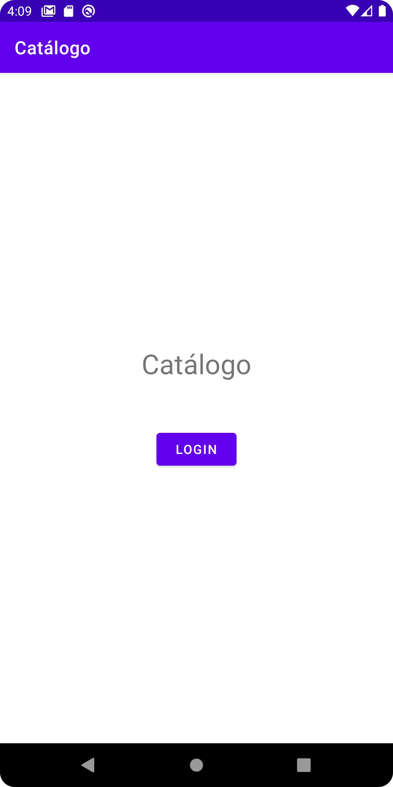

# Serverless App e IBM App ID
Ejemplo de un aplicativo Android que consume una Rest Api y atentificada por IBM Cloud App ID.

## Arquitectura

1. El Usuario se autentifica por medio de IBM App ID y obtiene tokens de identificación.
2. Se llama a la API incluyendo el token de acceso.
3. El backend valida con App ID el token de acceso enviado al API.
4. Una vez validado se accede a la base de datos.

## Capturas

### Autentificación

### Catálogo

### Nuevo Artículo

### Modificar Artículo

